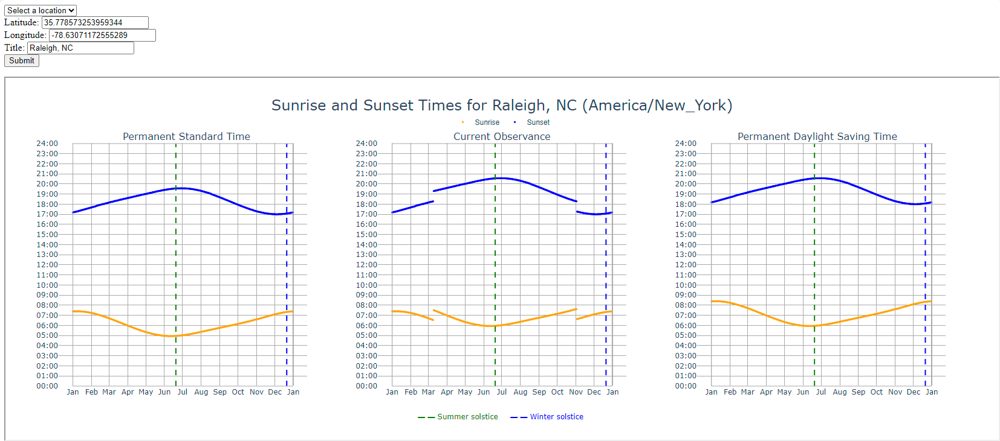

# Sunrise and Sunset Times Web Application

Shows the effect of permanent standard time or permanent daylight saving time for a location on Earth.

This web application provides an interface to select a location and view the sunrise and sunset times for the entire year. It uses Flask as the web framework, Plotly for data visualization, and the ephem library to calculate astronomical events.

## Features



- Visualization of sunrise and sunset times across three scenarios: permanent standard time, current
   observance, and permanent daylight saving time.
- Interactive plots with hover information for precise sunrise and sunset times.
- Custom input fields for latitude, longitude, and a title for new locations.
- Menu for selection of predefined locations

## Installation

Before running the application, you need to install the required Python packages. It is recommended to use a virtual environment.

```bash
# Create a virtual environment (optional)
python -m venv venv
# Activate the virtual environment
source venv/bin/activate  # On Windows, use `venv\Scripts\activate`
# Install the required packages
pip install -r requirements.txt
# Run the code
python app.py
```

## License
This project is licensed under a BSD License - see the LICENSE file for details.

## Contributing
Contributions are welcome! Please feel free to fork and submit a pull request.


## Support
If you encounter any issues or have questions, please file an issue on the GitHub repository.

## Authors
- Sean Ahern